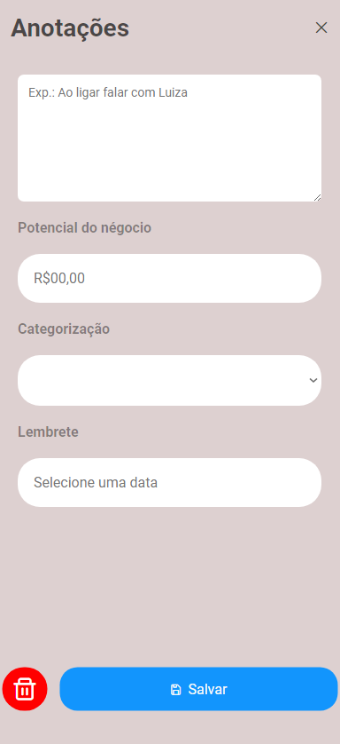

# Notes by Speedio 📋

Bem vindo Notes!

Esse é o layout desenvolvido para uma aplicação de anotações.

- A aplicação tem como objetivo criar, remover, editar e salvar suas anotações.

Tecnologias/Ferramentas Utilizadas:

- [Vue.js](https://vuejs.org)
- [TypeScript](https://www.typescriptlang.org)
- [PrimeIcon](https://primevue.org/icons/#spin)
- [Vue-Router](https://router.vuejs.org)
- [Vite](https://vitejs.dev)


## Telas 🖥️

- ### Tela Inicial

<p align="center">
   
</p>


- ### Tela de criação das notas 

<p align="center">
   
</p>

- ### Tela das anotações

<p align="center">
   
</p>

## Navegação 🚀

 - Ao iniciar a aplicação você entrará direto na tela inicial, clicando no botao + Criar anotação irá direto para a criação das anotações.
 - Após isso Caso você clique em salvar, ira para tela das Anotações.
 - Lembrando que por falta de conhecimento nao consegui desenvolver corretamente a Api para criação de notas, mas acredito que a implementação usando o meu layout é facil e prático.


## Instalação e Configuração 🔧

- Clone este projeto

```bash
    git clone https://github.com/RichardFFreitas/Bloco-notas-vuejs
```

- Tenha um Editor de código como Visual Studio Code, Sublime Text, etc. Depois entre na pasta Bloco notas vue com o comando:

```bash
    cd bloco-anotacoes-speedio
```

- depois instale as dependências com o seu gerenciador de pacotes

```bash
    npm installl

    #ou
    yarn

    #ou
    pnpm i
```

- Em seguida execute o comando de inicialização

```bash
    npm run dev

    #ou
    yarn dev

    #ou
    pnpm dev
```

